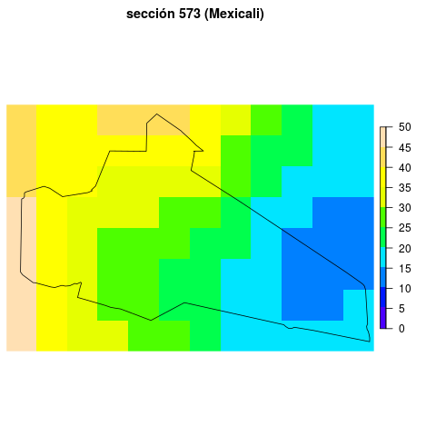

# Table of Contents

1.  [Description of *Nighttime lights in Mexico at units of substantive interest* repository](#org7c10754)
2.  [Acknowledgements](#org4ace167)
3.  [Donate](#orgb815a09)
4.  [References](#org59f5fa5)

---

Last revision: 2021-05-30

**News:** 

-   30may2021 Measures re-computed using INE's 2020 maps (instead of 2018 maps). Comments, critiques, and suggestions welcome by email.

-   5may2021 `data/municipios/` and `data/secciones/` now include luminosity measures for all 32 states. Validation detected a bug affecting smaller units (e.g. secciones in urban areas), producing large but short-lived surges/declines in luminosity measure. Bug has been fixed, new data no longer has this problem.

---

# Description of *Nighttime lights in Mexico at units of substantive interest* repository

-   Author: Eric Magar
-   Location <https://github.com/emagar/luminosity>
-   Email: emagar at itam dot mx
-   Citation for the data forthcoming

The repository distributes nighttime luminosity data for Mexico, aggregated at the municipal (N approx. 2,500) and *sección electoral* levels (N approx. 67,000). Luminosity rasters are from [Li, Zhou, Zhao and Zhao](https://www.nature.com/articles/s41597-020-0510-y)'s (2020) Harmonized Global Nighttime Light Dataset 1992-2018. 

The source reports annual observations geo-coded at a spatial resolution of about one square kilometer (30 arc seconds). This repository summarizes pixels within each unit's territory, reporting the mean unit luminosity, the median, and the standard deviation. While the source averages (and harmonizes) pixel luminosity in time, this repo averages pixels in space. The units chosen have analytical potential, as they can be associated with census indicators, electoral returns, and so forth.

An example from one unit clarifies the summary statistics distributed. The unit in question is sección number 573 in Mexicali, the capital city of the state of Baja California. The following map shows the source's statewide data. Tijuana's luminosity can be appreciated in the northwestern tip of the state, Ensenada's slightly southward, and Mexicali's in the northeast. The small red area is sección 573, in the city's suburbs, towards the Colorado river delta. (*Secciones* are Mexico's basic units for electoral management and cartography, analogous to U.S. census tracts.) 

The map below zooms into the unit, portraying luminosity in sección 573 and vincinity. (Shapefiles for secciones electorales and municipal boundaries are from [INE's cartography department](https://cartografia.ife.org.mx/sige7/?cartografia=mapas).) Artificial lights in the year 2018 portrayed decreased near monotonically as one progressed towards the sección's east-southeast. I relied on `R`'s `raster` package ([Hijmans 2019](https://cran.r-project.org/web/packages/raster/index.html)) in order to summarize the unit's luminosity.

The next map illustrates descriptive statistics generation (the code for this process is in script `code/export-seccion-stats.r`). `R`'s `raster::mask` operation selects pixels inside the sección's polygon, excluding the rest (which appear in white in the map). The mean luminosity, median, and standard deviation for the selected pixels are reported in annual state-by-state files in csv format in folder `data/secciones`. 

The time series can be appreciated in the final figure below. The sección's rapid urbanization is notable. Most of the area was quite dark in the mid-1990s, with mean nighttime lights of roughly 8GW per pixel, tripling by 2018.  The nighttime lightning aggregated in territorial units data offers a valuable indicator of human activity in Mexico's since the 1990s in small and analytically useful geographic units. 

# Acknowledgements

Eric Magar is grateful for financial support from the Asociación Mexicana de Cultura A.C. He is responsible for mistakes and shortcomings in the data. 

# Donate

If you find this useful, help buy a cup of coffee for the author and research assistants.  with Paypal.

# References

-   Hijmans, Robert J. 2019. `raster`: Geographic Data Analysis and Modeling ver 3.0-2,  <https://CRAN.R-project.org/package=raster>.
-   Li, Xuecao, Yuyu Zhou, Min Zhao, and Xia Zhao. 2020. A harmonized global nighttime light dataset 1992–2018. *Scientific Data* 7(1), <https://doi.org/10.1038/s41597-020-0510-y>.

