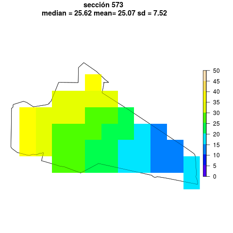

# Table of Contents

1.  [Description of *Nighttime luminosity in Mexico at analytical units* repository](#org46c73e4)
2.  [Acknowledgements](#org28900d1)
3.  [References](#orgccaa7f6)

---

Last revision: 2021-04-30

**New data** `data/municipios/` and `data/secciones/` distribute luminosity measures for the states of Baja California, Chiapas, Michoacán, and Veracruz. Stay tuned, more states to be added soon &#x2014; I need to debug these first. Comments, critiques, and suggestions welcome by email.  

---

# Description of *Nighttime luminosity in Mexico at analytical units* repository

-   Author: Eric Magar
-   Location <https://github.com/emagar/luminosity>
-   Email: emagar at itam dot mx

The repository contains nighttime luminosity data for Mexico, aggregated at the municipal (\(N \approx 2,500\)) and *sección electoral* levels (\(N \approx 67,000\)). Luminosity rasters are from [Li, Zhou, Zhao and Zhao](https://www.nature.com/articles/s41597-020-0510-y)'s (2020) Harmonized Global Nighttime Light Dataset 1992-2018. 

The source reports annual observations geo-coded at a spatial resolution of about one square kilometer (30 arc seconds). This repository summarizes pixels within each unit's territory, reporting the mean unit luminosity, the median, and the standard deviation. While the source averages (and harmonizes) pixel luminosity in time, this repo averages pixels in space. The units chosen have analytical potential, as they can be associated with census indicators, electoral returns, and so forth.

An example from one unit clarifies the summary statistics distributed. The unit in question is *sección* number 573 in Mexicali, the capital city of the state of Baja California. The following map shows the source's statewide data. Tijuana's luminosity can be appreciated in the northwestern tip of the state, Ensenada's slightly southward, and Mexicali's in the northeast. The small red area is *sección* 573, in the city's suburbs, towards the Colorado river delta. (*Secciones* are Mexico's basic units for electoral management and cartography, analogous to U.S. census tracts.) 

The next map zooms into the unit, portraying luminosity in sección 573 and vincinity. (Shapefiles for secciones electorales and municipal boundaries are from [INE's cartography department](https://cartografia.ife.org.mx/sige7/?cartografia=mapas).) Artificial lights in 2018 decreased near monotonically as one progressed towards the *sección*'s east-southeast. I relied on `R`'s `raster` package ([Hijmans 2019](https://cran.r-project.org/web/packages/raster/index.html)) in order to summarize the unit's luminosity.

The following map illustrates the process of summarizing (the code is in script `code/export-seccion-stats.r`). The `raster::mask` operation selects pixels within the *sección*'s polygon, excluding the rest (which appear in white in the map). Descriptive stats for the selected pixels are computed and reported in annual state-by-state files in csv format in `data/secciones`. 

The time series can be appreciated in the final figure below. The *sección*'s rapid urbanization is notable. The aggregated nighttime lightning data offers a valuable indicator of human activity in Mexico's municipalities and electoral secciones since the 1990s. 

# Acknowledgements

Eric Magar is grateful for financial support from the Asociación Mexicana de Cultura A.C. He is responsible for mistakes and shortcomings in the data. 

# References

-   Hijmans, Robert J. 2019. raster: Geographic Data Analysis and Modeling ver 3.0-2,  <https://CRAN.R-project.org/package=raster>.
-   Li, Xuecao, Yuyu Zhou, Min Zhao, and Xia Zhao. 2020. A harmonized global nighttime light dataset 1992–2018. *Scientific Data* 7(1), <https://doi.org/10.1038/s41597-020-0510-y>.

